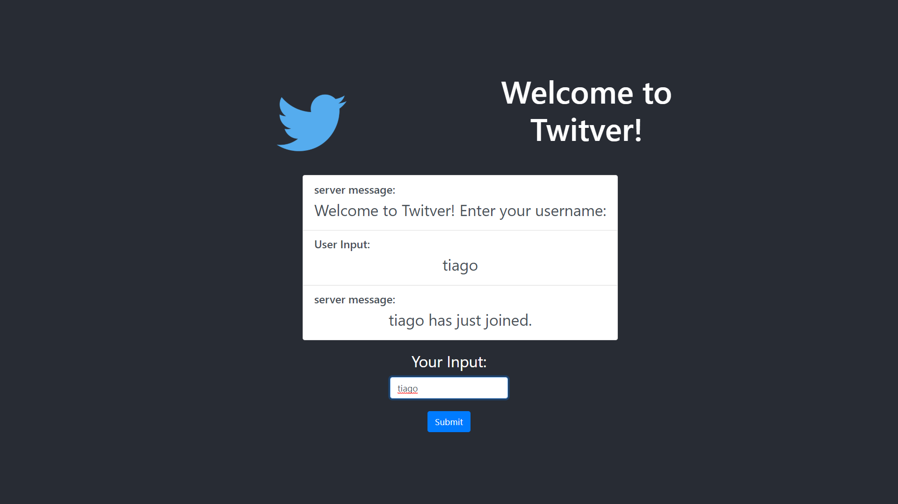

# Twitver

## Description

Developed a Twitter Like server in C that allows multiple user connections and user interaction (Follow, Unfollow, Send Messages, show latest Messages, Logout). Then Developed a React platform that serves as a UI for a client. Used Pythons Flask as backend API and connection between React and the server. 

## Stack
```
C
Python
- Flask
React
NodeJS
Fetch API
```

### Demo

